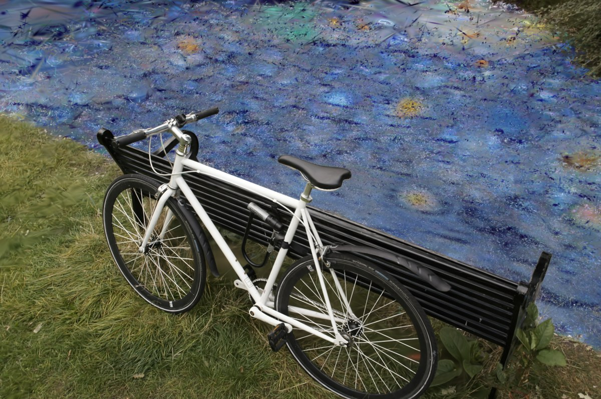
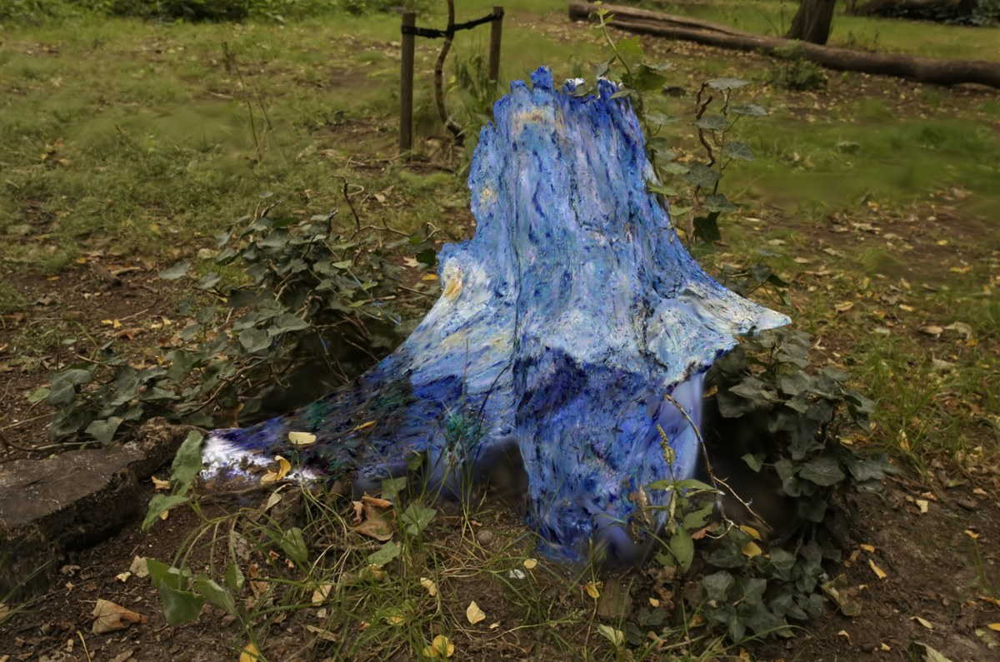
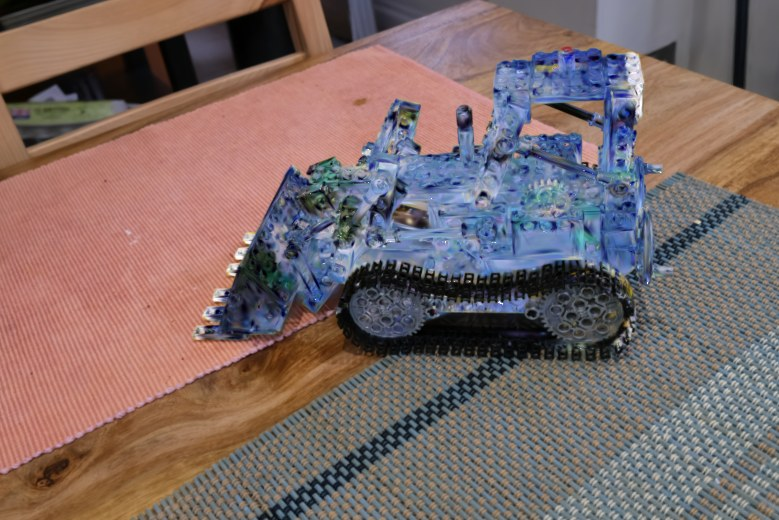
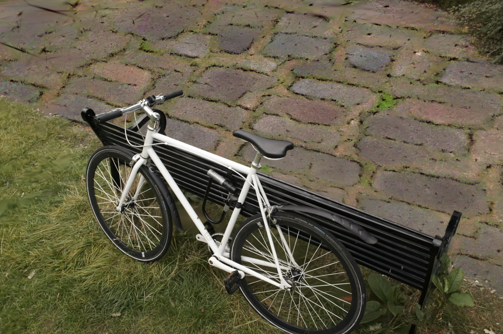
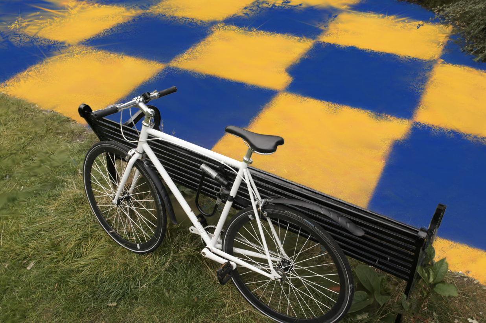
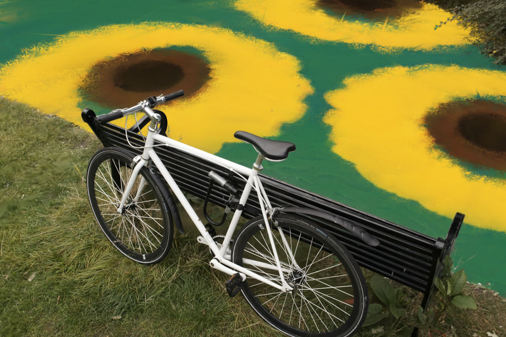
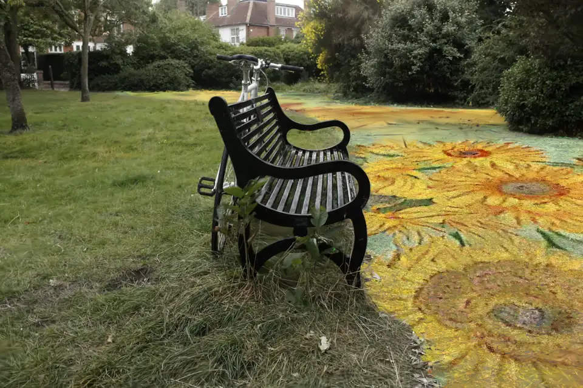
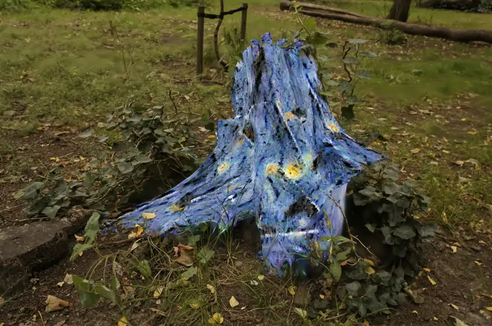

# RayStyle for 3D Gaussian Splatting

RayStyle applies local style transfer to a selected region of a pretrained
[3D Gaussian Splatting](https://repo-sam.inria.fr/fungraph/3d-gaussian-splatting/)
scene. It changes only the selected Gaussians' appearance while keeping their
position, scale, rotation, and opacity fixed. Geometry and all unselected
Gaussians remain unchanged. No diffusion model is used.

RayStyle is built on the scene loading and rendering components from
[3DGS-RTMaterial](https://github.com/NocturnalHairDoc/3DGS-RTMaterial).

## Demos

| Bicycle road | Stump | Kitchen bulldozer |
| :---: | :---: | :---: |
|  |  |  |

| Cobblestone road | Checkerboard road | Sunflower road |
| :---: | :---: | :---: |
|  |  |  |

| Sunflowers under held-out lighting | Starry Night under held-out lighting |
| :---: | :---: |
|  |  |

The portable [results dashboard](docs/project-results-dashboard/project-results-dashboard.html)
contains the full staged comparison and web-optimized experiment media.

## How it works

For the selected Gaussians, RayStyle learns:

- a charted 2D texture atlas (planar and tri-planar mappings are also available);
- roughness and metallic values;
- a bounded low-order spherical-harmonic residual.

Training uses calibrated scene cameras and optional HDR environments. The loss
combines reference-style matching, segment-cropped patch matching, DINO content
preservation, graph regularization, outside-region preservation, and
illumination consistency. The default `ours` method can be compared with three
simpler parameterizations:

| Method | Trainable appearance |
| --- | --- |
| `ours` | Atlas albedo, PBR material, and low-order SH residual |
| `dc` | DC color residual only |
| `full_sh` | All native SH coefficients |
| `pbr_only` | Per-Gaussian albedo, roughness, and metallic |

## Requirements

- Python 3.10
- PyTorch with CUDA support
- a working 3DGS environment and compatible CUDA rasterizer
- a compatible 3DGS-RTMaterial/SAGA checkout
- a trained Gaussian scene and a segment mask
- the original DINO ViT-B/8 checkpoint

Datasets, Gaussian checkpoints, DINO weights, masks, HDR maps, style images,
and training outputs are not included in this repository.

## Setup

Install RayStyle's Python dependencies into an existing 3DGS environment:

```bash
conda env update --file environment.yml
conda activate gaussian_splatting_v2
bash scripts/setup/download_dino_vitb8.sh
```

PyTorch and CUDA are intentionally not pinned because their versions must match
the upstream renderer. Avoid `conda env update --prune`, which may remove
required CUDA extensions.

## Configure a scene

Copy the example configuration:

```bash
cp configs/mvp.example.yaml configs/local_scene.yaml
```

Set the scene, renderer checkout, segment, style reference, DINO checkpoint,
optional HDR directory, and output path:

```yaml
workspace_root: /path/to/3DGS/workspace
scene: 3DGS-RTMaterial:bicycle
legacy_root: /path/to/3DGS-RTMaterial
project_state: /path/to/project_state.npz  # or precomputed_mask.pt
segment_id: 1
reference_image: /path/to/reference.jpg
dino_checkpoint: /path/to/dino_vitbase8_pretrain.pth
environment_dir: /path/to/hdr/files
output_dir: ../outputs/bicycle_style

train:
  texture_mapping: atlas
  texture_resolution: 512
  atlas_charts: 8
```

Use `inspect-segments` to list the one-based segment IDs stored in a GUI project
state:

```bash
python -m raystyle inspect-segments --project-state /path/to/project_state.npz
```

If fewer than six `.hdr` or `.exr` files are available, RayStyle fills the
environment pool with deterministic procedural maps.

## Train, evaluate, and view

```bash
# Train
python -m raystyle train --config configs/local_scene.yaml

# Evaluate fixed and held-out lighting
python -m raystyle evaluate \
  --config configs/local_scene.yaml \
  --checkpoint outputs/bicycle_style/checkpoint_latest.pt

# Open the interactive viewer
python -m raystyle view \
  --config configs/local_scene.yaml \
  --checkpoint outputs/bicycle_style/checkpoint_latest.pt \
  --scale 2
```

Training writes the resolved configuration, loss logs, previews, texture
images, and checkpoints to `output_dir`. The viewer supports calibrated and
free-orbit cameras, original/stylized comparison, HDR controls, and Atlas debug
views.

For independently trained, non-overlapping segments from the same scene:

```bash
cp configs/multisegment.example.yaml configs/local_multisegment.yaml
python -m raystyle view-bundle \
  --bundle configs/local_multisegment.yaml \
  --scale 2
```

For a completed four-method comparison:

```bash
python -m raystyle view-methods \
  --manifest outputs/method_baselines_400/manifest.json \
  --experiment bicycle_starry \
  --scale 2
```

## Validation

The repository includes reproducible pipelines for paired Atlas validation,
four-method baselines, and thin/non-planar segment stress tests:

```bash
python -m scripts.training.run_atlas_validation --help
python -m scripts.training.run_method_baselines --help
python -m scripts.training.run_segment_stress_validation --help
```

Current experiments show that Atlas improves style distance over the strongest
simpler baseline, but stronger style matching can increase DINO content
distance. More iterations are not always better, so checkpoints should be
selected using both metrics and visual review.

See [the experiment protocol](docs/EXPERIMENT.md),
[cross-scene results](docs/OTHER_SCENES_TEST.md), and the
[appearance-graph ablation](docs/GRAPH_SCOPE_ABLATION.md) for details.

## Repository layout

```text
raystyle/   training, rendering, losses, evaluation, and viewer
configs/    example single- and multi-segment configurations
scripts/    setup, preparation, training, and validation workflows
tests/      CPU-safe unit tests
docs/       experiment notes, demo media, and results dashboard
style/      location for user-provided reference images
```

## Limitations

- Training samples calibrated scene cameras rather than arbitrary poses.
- Atlas quality depends on the selected surface graph, normals, and charting.
- Strong curvature, sparse floaters, and narrow segments can introduce
  distortion, seams, or uneven texel density.
- Rendering still processes the full scene even when only a small region is
  edited.
- Multi-segment viewing composites independent runs; joint multi-reference
  optimization is not implemented.
